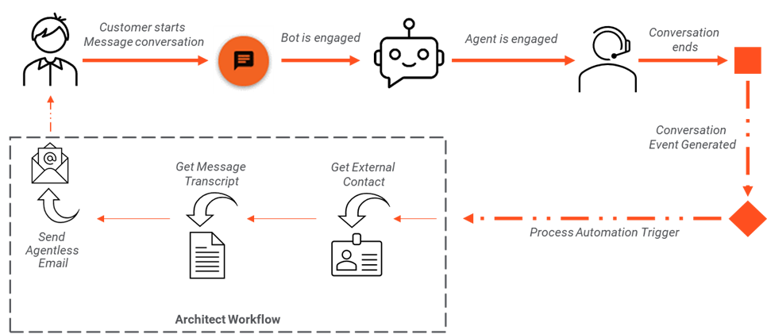
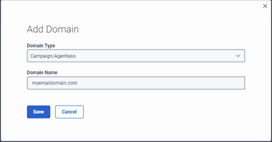
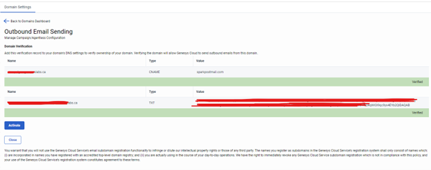

This Genesys Cloud Developer Blueprint demonstrates how to configure Genesys Cloud to send a customer a copy of their message transcript to their email address.



## Scenario

You want to provide a mechanism so your customers can choose to receive a copy of their message transcript by email. 

This blueprint shows how you can use native features in Genesys Cloud with little or no coding to send a copy of the message transcript to your customers by email:

* Configure an Architect workflow that uses data actions to:
  * Extract the email address of the customer.
  * Retrieve the transcript of the recent message conversation.
  * Send the transcript to the customer by email.
* Configure a trigger that listens for the event generated when a message conversation finishes and runs the workflow.


## Solution components

* **Genesys Cloud** - A suite of Genesys Cloud services for enterprise-grade communications, collaboration, and contact center management. In this solution, you use Architect flows, triggers, and data actions.
* **Architect flows** - A flow in Architect, a drag and drop web-based design tool, dictates how Genesys Cloud handles inbound or outbound interactions, and automated processes.
* **Agentless/Campaign Email Domain** - An email domain for an outbound email campaign or to trigger an agentless email notification. The use of outbound emails requires that you have your own email domain or subdomain.
* **Trigger** - A trigger is a resource within Genesys Cloud that allows customers to configure a reaction to a specific event that occurs within Genesys Cloud.
* **Data action** -  The data actions integrations allow you to gather data from external systems or Genesys Cloud, and then perform actions in Genesys Cloud applications like Architect Workflows.
* **Web Messaging and Messenger** -  Web Messaging provides enhanced experience to your customers who visit your site to have asynchronous conversations with a bot or agent. Messenger provides a predefined message window and launcher button which customers use to interact with bots and agents. In this solution, deploy a Messenger to your website.
* **CX as Code** - A Genesys Cloud Terraform provider that provides an interface for declaring core Genesys Cloud objects.

## Prerequisites

### Specialized knowledge

* Administrator-level knowledge of Genesys Cloud
* Experience with third-party email domain and DNS management
* Familiarity with Infrastructure as Code
* Experience adding scripts to HTML pages
* Experience using Terraform

### Genesys Cloud account

* A Genesys Cloud license. For more information, see [Genesys Cloud Pricing](https://www.genesys.com/pricing "Opens the Genesys Cloud pricing page") in the Genesys website.
* The Master Admin role. For more information, see [Roles and permissions overview](https://help.mypurecloud.com/?p=24360 "Opens the Roles and permissions overview article") in the Genesys Cloud Resource Center.
* CX as Code. For more information, see [CX as Code](https://developer.genesys.cloud/devapps/cx-as-code/ "Goes to the CX as Code page") in the Genesys Cloud Developer Center.

### Development tools running in your local environment

* Terraform (the latest binary). For more information, see [Download Terraform](https://www.terraform.io/downloads.html "Goes to the Download Terraform page") on the Terraform website.

## Implementation steps using CX as Code

### Download the repository that contains the project files

Clone the [send-message-transcript-by-email repository](https://github.com/GenesysCloudBlueprints/send-message-transcript-by-email "Opens the send-message-transcript-by-email repository") in GitHub.

### Set up Genesys Cloud

1. To run this project using the Terraform provider, open a terminal window and set the following environment variables:

 * `GENESYSCLOUD_OAUTHCLIENT_ID` - The Genesys Cloud client credential grant Id that CX as Code executes against. 
 * `GENESYSCLOUD_OAUTHCLIENT_SECRET` - The Genesys Cloud client credential secret that CX as Code executes against. 
 * `GENESYSCLOUD_REGION` - The Genesys Cloud region in your organization.

2. Run Terraform in the folder where you set the environment variables. 

### Configure a Campaign/Agentless email domain

If you have not previously configured a Campaign/Agentless domain in your Genesys Cloud organization, follow these steps:

1.	Click **Admin**.
2.	Under **Contact Center**, click **Email**.
3.	Click **+ Add Domain**.
4.	For **Domain Type**, select **Campaign/Agentless**.
5.	For **Domain Name**, enter the name of your email domain. For example, "myemaildomain.com".
   
   Click **Save**.
6.	Select the new email domain entry.
7.	Copy the values for CNAME and TXT to your domain’s DNS settings to verify the ownership of your domain. 
8.	After you have added these new records to your DNS service, click **Activate**.
   
9.	Your email server must be configured with an email address that you can use for sending emails to customers. Make a note of this email address as it is required for configuring the Terraform variable values.

### Create an OAuth Client for the Genesys Cloud Data Actions Integration

If you have not previouly configured an OAuth Client with a Client Credentials Grant in your Genesys Cloud organization, follow these steps: 

:::primary
**Note**
If you already have an OAuth client, make a note of the Client ID (GUID) and skip to the next section.
:::

1.	Click **Admin**.
2.	Under **Integrations**, click **OAuth**.
3.	Click **Add Client**.
4.	Give your OAuth client a unique name and select the **Client Credentials**.
5.	Click the **Roles** tab and assign the **Master Admin** role.
   **Note**: The Master Admin role is not a definitive requirement, but it is the easiest method to set up this blueprint solution. The actual permissions required for this blueprint solution are not in scope.
6.	Click **Save**.
7.	Make a note of the Client ID (GUID) for your new OAuth client. You need this GUID when you edit the Terraform variables configuration file.

### Configure your Terraform build

In the `blueprint/terraform/dev.auto.tfvars` file, set the following values, which are specific to your Genesys Cloud organization:

* `client_id` - The value of your OAuth Client ID using Client Credentials that you must use for the data action integration.
* `client_secret`- The value of your OAuth Client secret using Client Credentials that you must use for the data action integration.
* `agentless_email_fromAddress` - The email addresses to use when Genesys Cloud sends the email to the customer.
* `agentless_email_replyToAddress` - The email addresses to use when Genesys Cloud sends the email to the customer.
* `initial_target_customer_email` - The email address that Genesys Cloud uses to receive a copy of the message transcript for testing purposes. Configure this value in the inbound message flow that you want to use to test this solution.
* `external_contact_first_name` - The first name for the external contact associated with the message conversation to whom Genesys Cloud must send the transcript. After the initial execution of the message flow, Genesys Cloud associates the subsequent invocations and outbound emails with this external contact from a customer journey perspective.
* `external_contact_last_name` - The last name for the external contact associated with the message conversation to whom Genesys Cloud must send the transcript. After the initial execution of the message flow, Genesys Cloud associates the subsequent invocations and outbound emails with this external contact from a customer journey perspective.
* `external_contact_personal_email` - The email address for the external contact associated with the message conversation to whom Genesys Cloud must send the transcript. After the initial execution of the message flow, Genesys Cloud associates the subsequent invocations and outbound emails with this external contact from a customer journey perspective.

The following is an example of the `dev.auto.tfvars` file:

```
client_id                        = "your-client-id"
client_secret                    = "your-client-secret"
agentless_email_fromAddress      = "agentless-email-from-address@domain.com"
agentless_email_replyToAddress   = "agentless-email-reply-to-address@domain.com"
initial_target_customer_email    = "initial-target-customer-email@domain.com"
external_contact_first_name      = "external-contact-first-name"
external_contact_last_name       = "external-contact-last-name"
external_contact_personal_email  = "external-contact-personal-email@domain.com"
```

### Run Terraform

To run this blueprint solution in your organization, change to the `/terraform` folder and issue the following commands:

 * `terraform init` - Initializes a working directory that contains the Terraform configuration files.
   
 * `terraform plan` - Executes a trial run against your Genesys Cloud organization and shows you a list of all the Genesys Cloud resources it creates. Review this list and make sure that you agree with the plan before you continue to the next step.
 
 * `terraform apply --auto-approve` - Creates and deploys the necessary objects in your Genesys Cloud account. The `--auto-approve` flag completes the required approval step before the command creates the objects. After the command successfully completes, you see the output of the entire run along with the number of objects that Terraform successfully created.

 Keep the following points in mind:
 
 * The local state file in Terraform is named `terraform.tfstate`. The file is created and stored in the same folder as the project. Terraform recommends that you store the state file on a remote machine unless you want to run Terraform locally and are comfortable with the file deletion.

 * Use the `terraform destroy --auto-approve` command from the `docs/terraform` directory to clean up and remove all the objects that the local Terraform state file manages. Be sure that you have backed up your projects before you delete them.

### Test the solution

There are several ways to start a conversation to generate the detailed events for this integration.

Use the [Web Chat](https://developer.genesys.cloud/devapps/web-chat-messenger "Opens the Web chat/messaging Tools in the Genesys Cloud Developer Center") developer tool to test the deployment. For more information about the tool, see [Web Chat Widget](https://developer.genesys.cloud/commdigital/digital/webchat/widget-version2 "Opens the Web Chat Widget article in the Genesys Cloud Developer Center").

In the web chat widget, select the deployment named **Message Deployment for Sending Copy of Transcript by Email**.

## Additional resources

* [The send-message-transcript-by-email](https://github.com/GenesysCloudBlueprints/send-message-transcript-by-email) repository in GitHub
* [Set up a domain for outbound email campaigns and agentless email notifications](https://help.mypurecloud.com/articles/set-up-a-domain-for-outbound-email-campaigns/ "Opens the Set up a domain for outbound email campaigns and agentless email notifications article") in the Genesys Cloud Resource Center
* [CX as Code](https://developer.genesys.cloud/api/rest/CX-as-Code/ "Opens the CX as Code page") in the Genesys Cloud Developer Center
* [Terraform Registry Documentation](https://registry.terraform.io/providers/MyPureCloud/genesyscloud/latest/docs "Goes to the Genesys Cloud Provider page") in the Terraform documentation